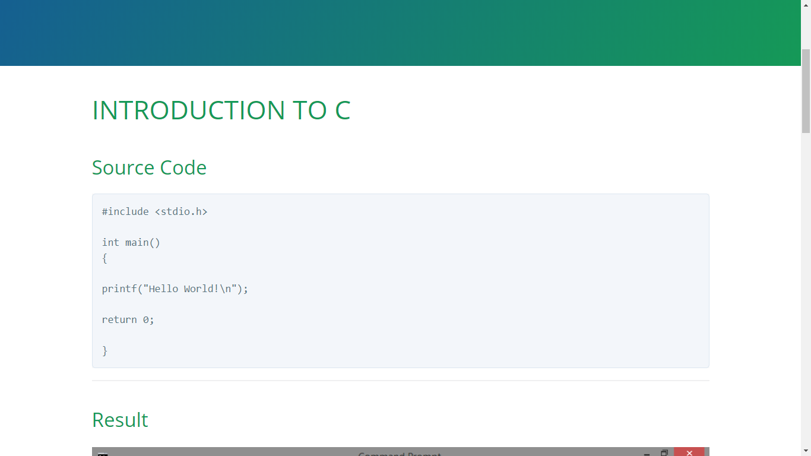
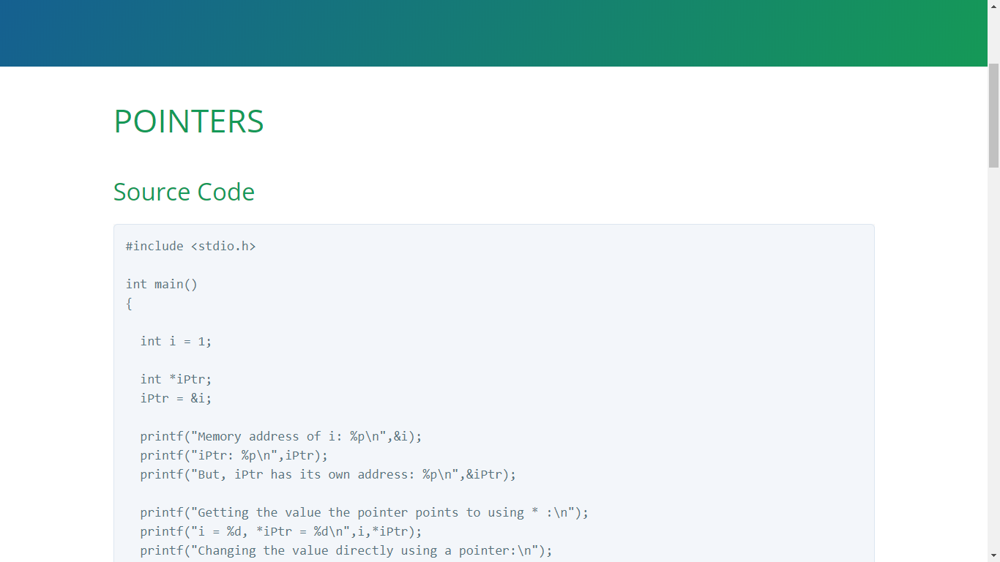
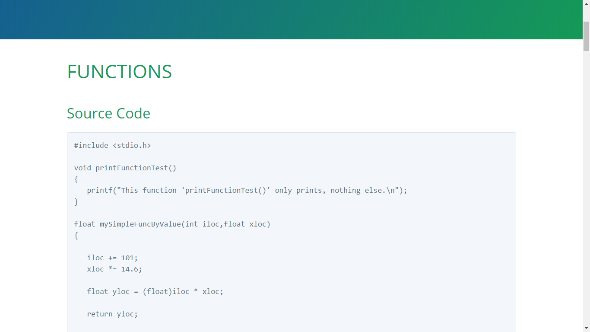
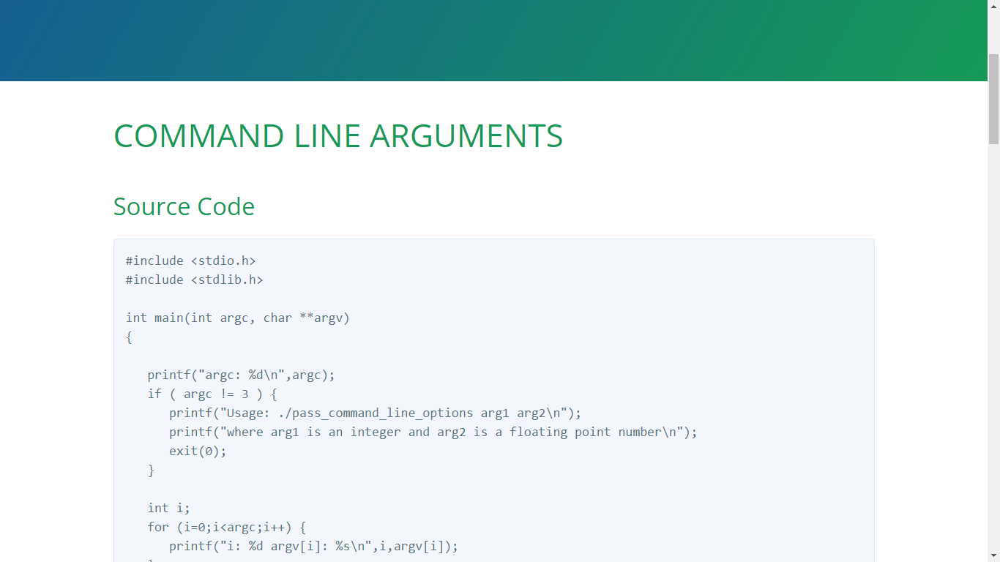
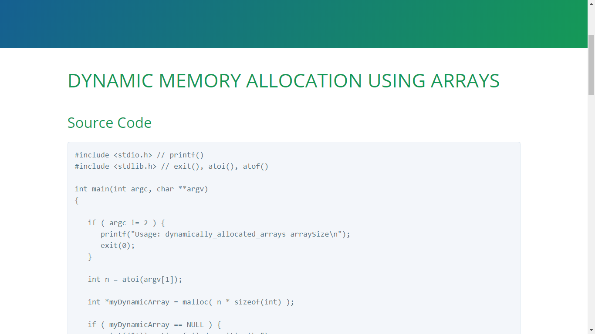

<!-- Global site tag (gtag.js) - Google Analytics -->
<script async src="https://www.googletagmanager.com/gtag/js?id=UA-146817309-1"></script>
<script>
  window.dataLayer = window.dataLayer || [];
  function gtag(){dataLayer.push(arguments);}
  gtag('js', new Date());

  gtag('config', 'UA-146817309-1');
</script>

# C Programming Tutorial

[](https://hits.seeyoufarm.com)

Thanks for visiting! 

We prepared a detailed 
documentation for you. You don't even need to
compile the source codes because there are screenshots
of the results!

Much more, we are willing to collaborate and communicate!
This is all about learning C, so we might not be
able to put every information, but we are willing
to answer your queries.

The source codes that were mentioned 
in this tutorial can be downloaded from 
this repository:

<https://github.com/xdvrx1/C-Language-Tutorial>

or by clicking the `View on GitHub` button.

Also, in order for you to truly collaborate,
you need a GitHub account and you need
to be at GitHub too.
There, you can
fork this repository, make some changes
then create a pull request 
and many more features.
It's quite strange at first but this is the best way to
develop a software as one team. Furthermore, GitHub can
be used for blogging and can be a collaborative tool for
non-code projects!
Also, this can be your portfolio as software developer,
so why not start exploring now. It's worth it. This is the link:

<https://github.com/join>

Topics
-----
[](001_hello_world/)

***

[](002_variable_types/)

***

[](003_flow_control/)

***

[](004_loops/)

***

[](005_pointers/)

***

[](006_functions/)

***

[](007_structures/)

***

[](008_pass_command_line_options/)

***

[](009_dynamically_allocated_arrays/)

***

[](010_file_IO/)

***

After this, you can study a good example
how these things are being applied 
in software development:

<https://github.com/xkcph2017x/CalC>

Although not all the topics here were covered,
but you can easily
grasp the idea because of this tutorial. 
Enjoy life full of coding projects!

## Why C language?
It's very important to understand why C language
is there and why it is not obsolete, as others 
believe. 

C was created on the premise that it
would be the tool to make utilities of the 
existing Unix. And later, Unix was 
rewritten using C.
But before C, there were problems that could not be
addressed by existing languages back then, such as:

- simplifying the existing
assembly languages to write programs but should be
almost of the same speed as them

- each assembler basically responds to a particular 
machine architecture

- existing languages such as COBOL, FORTRAN 
and BASIC were not meant to be for structured
programming

When C was introduced, it was the programming language
that answered these problems.
And then, there came a time, programs were complex
enough that *structured programming* would not suffice.
So, *object-oriented programming* (OOP) came into existence through
several programming languages like C++ and Java.
But remember, C is still the one for system
programming, say, creating
a programming language, an operating system,
and the like.

And since C language upgraded the world of
computer programming, its influence can be felt
in almost all programming languages after C.
Hence, it
will greatly help those who are still learning
computer programming in general, as
learning C will provide a solid background
because most of the programming languages
adopted concepts from it.

Building and Running Executables
--------------------

When using MinGW in Windows OS,
in the Command Prompt,
change the directory to where you put 
your source codes, say, on the Desktop.

And using `hello_world.c` as an example, type:

	gcc hello_world.c
		
hit `Enter`, then type:

	a.exe		
		
You will see the output in your console.

When you want a unique name for your executable,
type:

	gcc -o hello_world.exe hello_world.c
		
hit `Enter`, then type:

	hello_world.exe

### Using GNU Make
Make sure that GNU Make is installed in your computer.
Windows OS does not have this tool by default. So,
visit this site for more information, including how
to install it in Windows OS:

<http://gnuwin32.sourceforge.net/packages/make.htm>

GNU Make is a build tool that can run
commands automatically. It is used in large
projects, so programmers would not end up manually updating
every file that catches a lot of errors.

Here, we want to use Make as part of the demonstration,
to prepare you using this build tool.

First, you open the Command Prompt.
Change the directory to where you put your codes.
Then,

- to build all executables, type:

		make 

- to build a specific executable, type:

		make name_of_c_program

- to delete all executables, type:

		make clean

When you tell the Command Prompt to execute
the command `make`, it actually executes the 
contents of the `Makefile`. So, the computer and 
this tool will automate things for you, particularly,
in large projects to avoid errors and build
the software with ease.

Windows OS
-----

In Windows OS, it is best to use MinGW C compiler.
Please refer to <http://www.mingw.org/> for
full documentation.

Compiler
----

Compiler is a software that takes the job
of translating source codes into machine language,
one way or the other.

An assembly language, even though low-level,
will still be needing an assembler to translate
everything into an instruction the machine can understand.
So, every source code will always
be translated to machine language. But, it is not
up to us, humans, to do the translation manually.
That is the reason why writing compilers takes a lot
of skills and intellect. 

Technology companies usually offer their own compilers.
They created them
according to their own designs, 
to satisfy their needs or maybe to topple every business competitor.

License
----

ACCRE licensed this repo under MIT. 

Mong Alvarez Jr. included that license and
the changes he made were also licensed under MIT.

# INTRODUCTION TO C
## Source Code

```
#include <stdio.h> 

int main()
{

printf("Hello World!\n");

return 0;

}
```

***
## Result


***
## Details
### Including Files
In C, including files are common, just like
in our example:

```	
#include <stdio.h>   
```

It is just like copying the content of another source file 
and pasting it to the other one. Why not just copy and paste
manually? We usually don't do
that, it can cause errors. Hence, the need for 
this command. 

Separating one big source code into small ones is a good practice
in software development. Specific parts can be located easily.
The logic among them can be inferred without much hassle.

***
### The Main Function
This defines a function called `main`:

```
int main()
{

printf("Hello World!\n");

return 0;

}
```

The return type is an `int` (integer)
and it takes no arguments.
The main function is required for all
C programs. It's where execution of the
code begins.
I tend to use spaces to make blocks
of code more readable, you can also
use tabs.

***
### Outputting Results
This line calls a function called `printf`:

```
printf("Hello World!\n");
```

and passes a "Hello World!" string, along
with a special end of line character `\n`.
A semi-colon `;` is required at the end of 
each line. Take note, free-form languages just like C
does not terminate a command by simply pressing
`enter` or `return` to create a newline, it will
still look for the semicolon as the indicator that
a command is ended.

`printf` is actually printing output to `stdout`.
This topic is quite complex for this introduction,
but in basic terms, `printf` is one way to output
something. Much of the
hidden process is happening in the processor.
 
***
### Returning Status
Again, the return type for the main
function is an integer.

```
return 0;
```

Here, we return the 
integer zero, which is the convention 
for signifying that the program exited
normally. You actually don't need to
include this line at all. You might get
a warning from the compiler but the program
will compile and run normally.

# DATA TYPES
## Source Code

```
#include <stdio.h>

   int i;
   
   int j = 12;
   const int k = 345;
   unsigned int l = 6789;

   char myletter[] = "myletter";
   float x = 1.23;
   double y = 45.6789;

   int myarray[5] = { 2, 4, 6, 8, 10 };
   float farray[100];

int main()
{

   i = 1;
   printf("int i: %d\n", i);

   printf("int j: %d\n", j);
   printf("const int k: %d\n", k);
   printf("unsigned int l: %d\n", l);

   printf("char myletter[]: %s\n", myletter);
   
   printf("float x: %f\n", x);
   printf("double y: %f\n", y);

   printf("(@index 0) int myarray[0] : %d\n", myarray[0]);
   printf("(@index 0) float farray[0] : %1.2f\n", farray[0]);
   
   return 0;
}
```

***
## Result


***
## Details
### Data Types and Compiler
Data types are very important in a programming language.
In basic terms, they tell how data
should be treated by the compiler.
Other programming languages are just loosely type, but still,
they have data types.

***
Declare an integer: 

	int i;

***
Declare and initialize an integer:
 
	int j = 12;

***
Declare and initialize a constant integer:
	
	const int k = 345;

***
Declare and initialize an unsigned integer:

	unsigned int l = 6789;

***
Declare and initialize a string called "myletter":
	
	char myletter[] = "myletter";

Take note: In C, strings are just one-dimensional 
array of characters.  

***
Declare and initialize a single-precision floating point number:

	float x = 1.23;

***
Declare and initialize a double-precision floating point number:

	double y = 45.6789;

***
Arrays are contiguous in memory and can be
accessed like so: 
	
	myarray[0], myarray[1], ...

Note that the first index is always 0 in C!

***
Declare and initialize a 5-element integer array:
	
	int myarray[5] = { 2, 4, 6, 8, 10 };

***
Declare a 100-element array of single-precision floating point numbers:

	float farray[100];
	
# FLOW CONTROL
## Source Code

```
#include <stdio.h>

int main()
{

  int i = 1;
  if ( i ) printf("i is true with a value of: %d\n", i);

  i = 123;
  if ( i ) printf("i is true with a value of: %d\n", i);

  i = -321;
  if ( i ) printf("i is true with a value of: %d\n", i);

  i = 0;
  if ( i ) {
     printf("i is true with a value of: %d\n", i);
  }
  else {
     printf("i is false with a value of: %d\n", i);
  }

  int y = 26;
  if ( i > 0 && y == 26 ) {
     printf("Condition 1 met!\n");
  }
  else if ( i > 0 || y == 25 ) {
     printf("Condition 2 met!\n");
  }
  else if ( i != 0 ) {
     printf("Condition 3 met!\n");
  }
  else if ( !i && y >= 20 ) {
     printf("Condition 4 met!\n");
  }
  else if ( i == 0 ) {
     printf("Condition 5 met!\n");
  }
  else {
     printf("no condition met!\n");
  }

  if ( y == 26 ) {
     if ( i != 0 ) {
        printf("i is not 0!\n");
     }
     else {
        printf("i is 0\n");
     }
  }

  return 0;

}
```

***
## Result


***
## Details
### True? False?	
We stick first to conditional statements,
because this can alter the execution
of the program by making decisions
and skipping some parts of the code.   

Native `Boolean` data type does not exist in C.
Integer is used instead, with a 
value of zero evaluated as `FALSE` and a non-zero
value evaluated as `TRUE`.

***
This will resut to `TRUE` because `i` is `TRUE`
with a value of 1:

```
  int i = 1;
  if ( i ) printf("i is true with a value of: %d\n", i);
```

***
This will result to `TRUE` because `i` is `TRUE`:
it is not zero, it is 123. 

```
  i = 123;
  if ( i ) printf("i is true with a value of: %d\n", i);
```

***
This will still result to `TRUE` because `i` is
still `TRUE`: it is not zero, it is -321.
 
```  
  i = -321;
  if ( i ) printf("i is true with a value of: %d\n", i);
```

***
This will result to `FALSE` because `i` is now zero.

```
  i = 0;
  if ( i ) {
     printf("i is true with a value of: %d\n", i);
  }
  else {
     printf("i is false with a value of: %d\n", i);
  }
```

***
### if-else 
Note that in a large `if-else` block like the one
below, program flow jumps out of the block after
the first match is found. Its contents are 
executed, then this `if-else` block is done. 

```
  int y = 26;
  if ( i > 0 && y == 26 ) {
     printf("Condition 1 met!\n");
  }
  else if ( i > 0 || y == 25 ) {
     printf("Condition 2 met!\n");
  }
  else if ( i != 0 ) {
     printf("Condition 3 met!\n");
  }
  else if ( !i && y >= 20 ) {
     printf("Condition 4 met!\n");
  }
  else if ( i == 0 ) {
     printf("Condition 5 met!\n");
  }
  else {
     printf("no condition met!\n");
  }
```

In our case here, `Condition 4` is the first
match, even if `Condition 5` is also true,
it will not continue
seeking for the other matches.
This is why `Condition 5 is met!` is not
printed.

***
### Nesting Multiple if and if-else Statements
Nested `if` and `if-else` blocks are also allowed:

```
  if ( y == 26 ) {
     if ( i != 0 ) {
        printf("i is not 0!\n");
     }
     else {
        printf("i is 0\n");
     }
  }
```

As we see here, there are two `if` conditions,
so the program flow will be like:

Is it really true that `y` is equal to 26?
If yes, proceed to the second `if`.
If not, this `if` block is done, cancel
everything inside this block, including
the `if-else`.

In our case here, `y` is really equal to 26,
so it goes down to the second `if`
that tests whether `i` is not equal to zero,
but according to the last value of `i`,
it is zero, so it will execute
the `else` block, so it prints `i is 0`.

***
After this, you can now easily grasp the idea
of loops, where it automates things for you.	

# LOOPS
## Source Code

```
#include <stdio.h>

int main()
{
   
   int n = 10;

   int i;
   int x[n];
   for ( i=0; i<n; i++ ) {
      x[i] = i * 10;
      printf("i: %d x[i]: %d\n", i, x[i]);
   }
  
   int y = 0;
   while ( y < 100 ) {
      y += 12;
      printf("y: %d\n", y);
   }

   y = 0;
   do {
      y += 12;
      printf("y: %d\n", y);
   }
   while ( y < 100 );

   return 0;

}
```

***
## Result


***
## Details
### for Loop
We will use `i` as an index within `for` loop:

```
  int i;
   int x[n];
   for ( i=0; i<n; i++ ) {
      x[i] = i * 10;
      printf("i: %d x[i]: %d\n", i, x[i]);
   }
```

Here, `i` will start at 0. Then, it will test whether
`i` is less than `n` which is 10. If this test evaluates to true,
it will execute the commands. That range will be from 0 to 9.
Then, when the value of `i` is 10,
it stops looping because 
`i < n` evaluates to false. Then, this `for` loop is done.

***
### while Loop
`while` loop is useful in certain situations as well:

```
   int y = 0;
   while ( y < 100 ) {
      y += 12;
      printf("y: %d\n", y);
   }
```

In `while` loop, it will first test the condition.
If the condition evaluates to false, it will be skipped,
so, `while` loop 
may not execute the commands at all.

But in the example here, `while` loop succeeded. 

***
### do-while Loop
`do-while` loop is used instead of `while` loop
if you want the code block executed before evaluation
of a condition, *at least once*.

```
   y = 0;
   do {
      y += 12;
      printf("y: %d\n", y);
   }
   while ( y < 100 );   
```

***
Now, here is the tricky part: in our example,
you will notice that both
`do-while` and `while` loops ended at 
the value of 108, but the problem
is that, in the given condition, `y` should be 
less than 100 to continue looping
or else it should stop looping. Then why these loops ended at 108?

# POINTERS
## Source Code

```
#include <stdio.h>

int main()
{

  int i = 1; 

  int *iPtr;
  iPtr = &i;

  printf("Memory address of i: %p\n", &i);
  printf("iPtr: %p\n", iPtr);
  printf("But, iPtr has its own address: %p\n", &iPtr);
  
  printf("Getting the value the pointer points to using * :\n");
  printf("i = %d, *iPtr = %d\n", i, *iPtr);
  printf("Changing the value directly using a pointer:\n"); 
  *iPtr = 2;
  printf("After using \"*iPtr = 2;\", i is now %d\n", i);

  return 0;

}
```

***
## Result


***
## Details
### Pointers
A normal integer is declared like the one below.
This assigns a piece of memory for `i`,
and stores the value 1 in this memory.

```  
  int i = 1;
``` 

On the other hand, pointers were introduced as a way to 
access a memory location directly and
the value stored there.

Declare a pointer with the `*` character:

```
  int *iPtr;
```

A pointer is a variable that contains memory address. But that
pointer has its own memory address too.

```
  printf("Memory address of i: %p\n", &i);
  printf("iPtr: %p\n", iPtr);
  printf("But, iPtr has its own address: %p\n", &iPtr);
```  

***
#### Referencing and Dereferencing
You can **reference** a variable's memory using the `&` symbol.
Then, after getting that memory address, you can store it in 
a pointer variable, in our case here, it is `iPtr`.

```
  iPtr = &i;
```

You can also access the value in memory that a 
pointer is pointing to using the `*` symbol,
in our case here, `*iPtr`. This
is called **dereferencing**.

```
  printf("i: %d, *iPtr: %d\n", i, *iPtr);
```

***
There are several benefits of using pointers, one
is passing function arguments by reference, which
is illustrated in the `functions.c` example. 

With pointers, you have the ability to alter directly the value
stored in a memory location:

```
  *iPtr = 2;
  printf("After using \"*iPtr = 2;\", i is now %d\n", i);
```
