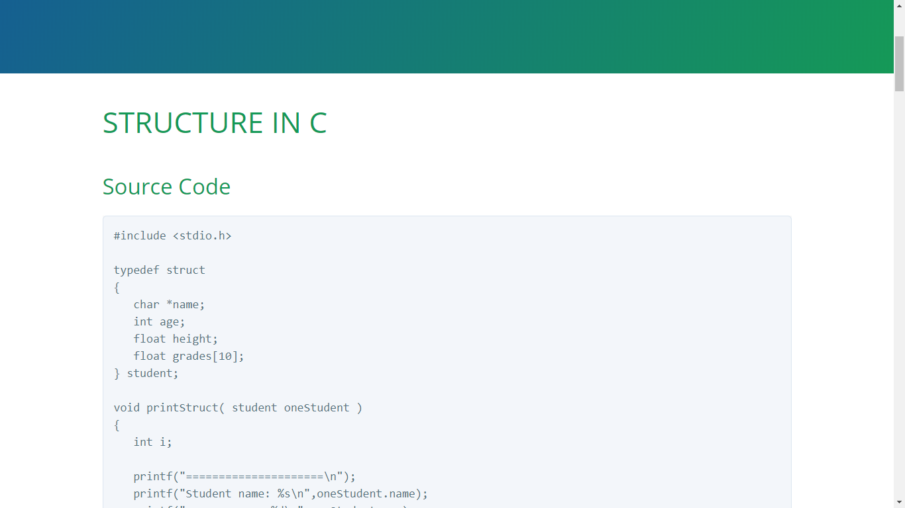
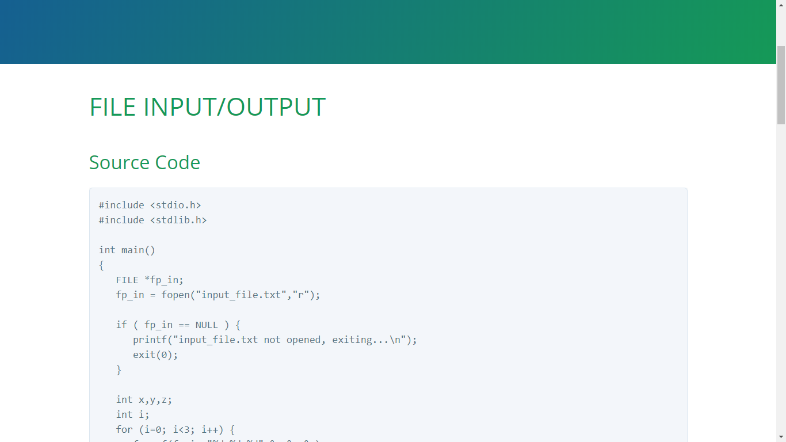

<!-- Global site tag (gtag.js) - Google Analytics -->

C Programming Tutorial
======================
Thanks for visiting! 

We prepared a detailed 
documentation for you. You don't even need to
compile the source codes because there are screenshots
of the results!

Much more, we are willing to collaborate and communicate!
This is all about learning C, so we might not be
able to put every information, but we are willing
to answer your queries.
You can ask questions through email:

<mongAlvarez@gmail.com>

The source codes that were mentioned 
in this tutorial can be downloaded from 
this repository:

<https://github.com/mongAlvarez/C-Programming-Tutorial>

or by clicking the `View on GitHub` button.

Also, in order for you to truly collaborate,
you need a GitHub account and you need
to be at GitHub too.
There, you can
fork this repository, make some changes
then create a pull request 
and many more features.
It's quite strange at first but this is the best way to
develop a software as one team. Furthermore, GitHub can
be used for blogging and can be a collaborative tool for
non-code projects!
Also, this can be your portfolio as software developer,
so why not start exploring now. It's worth it. This is the link:

<https://github.com/join>

Topics
-----

***

***

***

***

***

***

***

***

***

***

After this, you can study a good example
how these things are being applied 
in software development:

<https://github.com/mongAlvarez/CalC>

Although not all the topics here were covered,
but you can easily
grasp the idea because of this tutorial. 
Enjoy life full of coding projects!

## Why C language?
It's very important to understand why C language
is there and why it is not obsolete, as others 
believe. 

C was created on the premise that it
would be the tool to make utilities of the 
existing Unix. And later, Unix was 
rewritten using C.
But before C, there were problems that could not be
addressed by existing languages back then, such as:

- simplifying the existing
assembly languages to write programs but should be
almost of the same speed as them

- each assembler basically responds to a particular 
machine architecture

- existing languages such as COBOL, FORTRAN 
and BASIC were not meant to be for structured
programming

When C was introduced, it was the programming language
that answered these problems.
And then, there came a time, programs were complex
enough that *structured programming* would not suffice.
So, *object-oriented programming* (OOP) came into existence through
several programming languages like C++ and Java.
But remember, C is still the one for system
programming, say, creating
a programming language, an operating system,
and the like.

And since C language upgraded the world of
computer programming, its influence can be felt
in almost all programming languages after C.
Hence, it
will greatly help those who are still learning
computer programming in general, as
learning C will provide a solid background
because most of the programming languages
adopted concepts from it.

Building and Running Executables
--------------------

When using MinGW in Windows OS,
in the Command Prompt,
change the directory to where you put 
your source codes, say, on the Desktop.

And using `hello_world.c` as an example, type:

	gcc hello_world.c
		
hit `Enter`, then type:

	a.exe		
		
You will see the output in your console.

When you want a unique name for your executable,
type:

	gcc -o hello_world.exe hello_world.c
		
hit `Enter`, then type:

	hello_world.exe

### Using GNU Make
Make sure that GNU Make is installed in your computer.
Windows OS does not have this tool by default. So,
visit this site for more information, including how
to install it in Windows OS:

<http://gnuwin32.sourceforge.net/packages/make.htm>

GNU Make is a build tool that can run
commands automatically. It is used in large
projects, so programmers would not end up manually updating
every file that catches a lot of errors.

Here, we want to use Make as part of the demonstration,
to prepare you using this build tool.

First, you open the Command Prompt.
Change the directory to where you put your codes.
Then,

- to build all executables, type:

		make 

- to build a specific executable, type:

		make name_of_c_program

- to delete all executables, type:

		make clean

When you tell the Command Prompt to execute
the command `make`, it actually executes the 
contents of the `Makefile`. So, the computer and 
this tool will automate things for you, particularly,
in large projects to avoid errors and build
the software with ease.

Windows OS
-----

In Windows OS, it is best to use MinGW C compiler.
Please refer to <http://www.mingw.org/> for
full documentation.

Compiler
----

Compiler is a software that takes the job
of translating source codes into machine language,
one way or the other.

An assembly language, even though low-level,
will still be needing an assembler to translate
everything into an instruction the machine can understand.
So, every source code will always
be translated to machine language. But, it is not
up to us, humans, to do the translation manually.
That is the reason why writing compilers takes a lot
of skills and intellect. 

Technology companies usually offer their own compilers.
They created them
according to their own designs, 
to satisfy their needs or maybe to topple every business competitor.

License
----

ACCRE licensed this repo under MIT. 

Mong Alvarez Jr. included that license and
the changes he made were also licensed under MIT.
